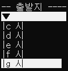
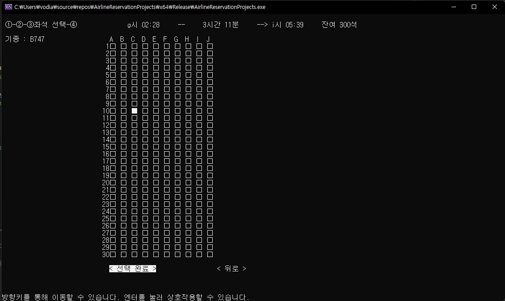

# 가상 비행기 예약 시스템

가상의 26개의 도시와 무작위 도시간 단방향 경로를 100개를 만들고 무작위 비행 일정을 생성한다.
그리고 500개의 무작위 예약 기록을 생성한다.
사용자는 출발 도시와 도착 도시, 날짜, 좌석 등급을 선택하고 최소 소요 시간 경로를 검색할 수 있다.

## 프로그램 실행

### 실행 예시

### 처음 화면

초기화 화면이다. 500개의 무작위 예약 기록 생성에 시간이 소요된다.

### 메인 화면

초기화 이후 처음 화면이다. 사용자는 여기서 출발지, 도착지, 출발 날짜, 좌석 등급을 선택하여 항공권을 검색할 수 있다.

위와 같이 콤보 박스 형태로 출발지, 도착지, 출발 날짜를 선택할 수 있다.

항목을 모두 선택하고 검색하면 BFS 알고리즘으로 모든 가능한 경로를 찾는다(최대 소요 시간 제한이 있음).
찾은 경로들을 위와 같이 최단 소요 시간 경로부터 차례대로 보여준다.

### 예약 화면

항공권을 검색하고 하나를 선택하면 각 비행 일정과 정보를 보여준다.

예약하기 버튼을 누르면 위와 같이 개인 정보를 입력하는 화면을 보여준다.

계속 버튼을 누르면 위와 같이 좌석을 선택하는 화면을 보여준다. 예시에서 예약은 4번의 비행 일정을 갖고 있으므로 4번의 좌석 선택을 하게 된다.

좌석 선택이 끝나면 최종적으로 예약 정보를 확인하는 화면이 나오고, 예약하기 버튼을 눌러 예약을 완료할 수 있다.

### 예약 기록 화면

예약 기록은 메인 화면에서 예약 기록 보기 버튼을 통해 진입할 수 있다. 가장 마지막 페이지에서 방금 예약한 기록을 확인할 수 있다.

## 구현 특징

### 인터페이스

인터페이스 구현은 Page와 View라는 객체를 만들어서 구현하였다.

Page는 화면을 의미한다. 다른 화면으로 넘어갈 때에는 보여줄 Page를 넘어갈 Page로 교체를 해주기만 하면 된다.

View는 텍스트, 버튼, 콤보 박스, 텍스트 입력칸 등을 의미한다. Page에는 View를 추가할 수 있다.

따라서 위와 같이 보여줄 화면, 화면 상의 위치, 타입(텍스트, 버튼 등), 보여줄 텍스트, 버튼의 경우 눌렀을 때 
작동할 기능 등을 입력하면 정해진 포맷으로 쉽게 만들 수 있도록 구현하였다.
이러한 방식은 코드의 재사용성을 증가시켜 시스템 구현 시간을 많이 단축시켜 주었다.